# Machine Learning 2 Project

Participants: Benjamin Habicht, Tobias Lory, Thomas Steffek, Pascal Stehling

The chosen methods: Decision Tree (ML1), Support Vector Machine (ML2)

## Short Data Set Description

### Synopsis

We chose the Contraceptive Method Choice Data Set from the UCI Machine Learning Repository at the Center for Machine Learning and Intelligent Systems. The data set is a subset of a Contraceptive Prevalence Survey from 1987 in Indonesia. The test subjects were married women who were either not pregnant or did not know whether the were pregnant.

### Variables

The target variable is the current contraceptive method choice. There are 3 options:

- no use
- long-term methods
- short-term methods

The target variable is therefore categorical. There are in total 9 predictor variables:

- Wife's age (numerical)
- Wife's education (categorical) 1=low, 2, 3, 4=high
- Husband's education (categorical) 1=low, 2, 3, 4=high
- Number of children ever born (numerical)
- Wife's religion (binary) 0=Non-Islam, 1=Islam
- Wife's now working? (binary) 0=Yes, 1=No
- Husband's occupation (categorical) 1, 2, 3, 4
- Standard-of-living index (categorical) 1=low, 2, 3, 4=high
- Media exposure (binary) 0=Good, 1=Not good

### t-SNE Plot

It is interesting to see if it is possible for the tSNE algorithm to transform the data into a two-dimensional plane. If this is possible, then we expect a high accuracy for our classification algorithms. Here you can see the plot:

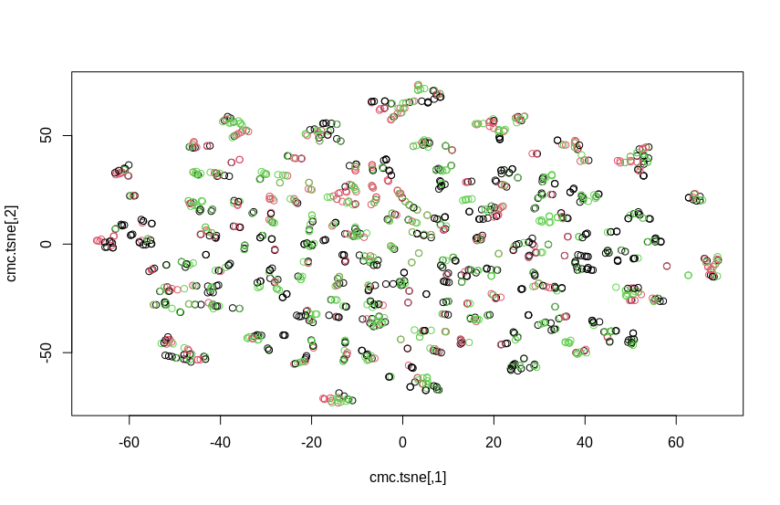

Sadly the tSNE algorithm was not able to differentiate the groups. It looks like it is not easy to find a two-dimensional representation that is able to separate the data.

## Mathematical Overviews

### Mathematical Overview of the Support Vector Machine

While trivial in nature, the mathematical formulas behind the Support Vector Machine are best explained using a three-step-approach: starting with the oversimplified and constrained Maximal-Margin Classifier, we will gradually increase the complexity of the problem to first explain the reasoning behind the Support Vector Classifier and finally of the Support Vector Machine.

We will discuss the exemplary case of a 2-dimensional problem (i.e. the data has two predictor variables). Moving to a higher-dimensional space is trivial afterwards.

#### Maximal-Margin Classifier

The Maximal-Margin Classifier (MMC) is the most basic simplification of the support vector machine.

In addition to our 2-dimensional dataset, we assume a binary classification task. Further, for the MMC to work, our data needs to be linearly separable.

Linearly separable means, there exists a line (in higher dimensions this line is called *hyperplane*), which separates all data correctly. This raises the question: how do we find this line?  
A general line can be defined with the following equation:

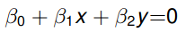 (1)

If we know the β values it is easy to then classify a data point (x,y): if the result of equation (1) is positive, a point belongs to class 1, else to class 2. This can be seen as the point lying above or below the line.

To find the best line that separates the data we try to choose β values, such that the distance of every point to the line is maximized, while correctly positioning the data points below or above the line according to their labels.
This is achieved by the following equation:

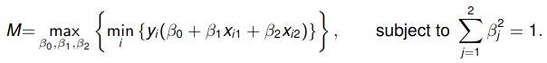

Where yi(...) is the distance of a point (xi1, xi2) to our separating line. *M* is then the margin between the line and its closest three points, the so-called support vectors. These are the only points required for constructing the line, removing any other vector would not change the resulting line. A representation can be seen in the following image.

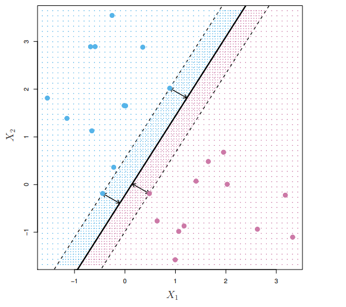

The β size constraint originates from the need of having a singular solution. Since our line representation is overparametrized, it normally would have unlimited solutions.

#### Support Vector Classifier

Real problems, however, are often not perfectly linearly separable. What do we do, if the
problem is mostly linear, but has some outliers?

We need to allow some points to go over the margin. To achieve this we introduce *slack variables* for every observation 𝜖1, ..., 𝜖n.
This results in the following, adjusted equation:

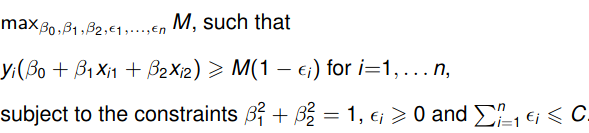

An 𝜖i will be zero, if the point is on the correct side of the line, and increasingly bigger depending on how far it is within the margin or beyond the line (bigger than one results in a misclassification). *C* is therefore a hyperparameter which allows us to adjust how many points can be incorrectly represented by the resulting classifier. This results in a wider margin for large *C*, and a smaller margin for small *C*.

With this adjustment, all points within the margin or on the other side of the line become support vectors. Again, any other points can be removed without changing the classifier.

#### Support Vector Machine

The next complexity step is removing the linearity constraint. An SVM tackles the problem to classify data where a linear boundary is not sufficient.

Therefore, the concept of a kernel is introduced: Utilizing the so-called *kernel trick* we transform the data from the original space to a higher dimensional space. We hope to find a linear separation in the higher dimensional space. This transformed problem can then be solved with a Support Vector Classifier.

We use the following formula to transform the data:

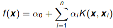

With *K* being the kernel function. This is again an adjustable (and optimizable) hyperparameter. Common cases are the polynomial kernel function:

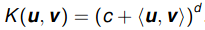

and the radial kernel:

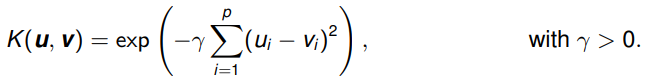

They result in a polynomially transformed (left, of degree 3) or radial (right) boundary, respectively:

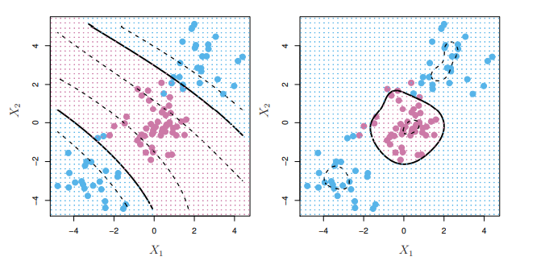

It's left to note, that, since the kernel trick introduces an additional dimension during computation, the resulting boundary can often not be represented using a formula in the lower dimension.

### Mathematical Overview Decision Tree

Decision trees are a predictive model that function through segmenting the
predictor space into a small number of simple non-overlapping regions
$R_1,\ R_2,\ \dots,\ R_n$. For simplicity the regions have the shape of
rectangular boxes, these boxes are constructed in such a way as to minimize

\begin{equation}
\sum_j{(1-\underset{k}{\text{max}}(p_{jk}))}
\end{equation}

the total classification error rate. Here $p_{jk}$ is the proportion of
observations in region $j$ that belongs to class $k$.
The tree is build through a top-down process called recursive binary splitting.
This process starts with a single node tree, our future root. For each node we
determine a binary split for one of the attributes with a split value $s$ with
all observations then being assigned to one of the child nodes respective to if
their attribute value is less than or greater/equal to $s$. $s$ is chosen in a
way which maximally increases the purity of each of the two resulting new nodes.
Purity is a measure for all observations in a node belonging to the same class
and can be calculated by the Gini index $G_j$

\begin{equation}
G_j=\sum_k{p_{jk}(1-p_{jk})}
\end{equation}

When all observations belong to the same class the Gini index has a value of $0$,
i.e. a smaller Gini index is desirable.
This process is then repeated on each new child node and stops if either the
resulting child nodes only contain a small number of observations or the new
split leads to an insignificant increase in purity.

An observation class can be predicted by following down the tree from the root
choosing paths according to the splitting values until ones arrives at a leaf
node. The leaf nodes correspond to our Regions $R_i$. The predicted class is
then the mode of the classes of all observations assigned to that node. A tree
generated through the above process will often be over-fitted to the training
data. A process to improve generalization is pruning which can be combined with
$K$-fold cross validation. In that we choose a random number of sub-trees with
different quantities of leaf nodes and examine their performance on different
folds of the training data set. The sub-tree with the best performance will then
be chosen as the final tree.

## Fitting Processes and Results

For all our fitting processes we use the recommended splits of (0.6, 0.2, 0.2). All processes in this section will only use the train or the validation split.

### SVM Fitting Process

In this section, we will explain the fitting process for our Support Vector Machine in detail. To this end, we will first go over the details of our hyperparameter optimization. Afterwards, we briefly evaluate our results.

We use the svm function of the e1071 package.

#### Hyperparameter Optimization

To fit our Support Vector Machine, we perform a hyperparameter search over all applicable parameters for each kernel.

We pick our ranges by traversing each parameter logarithmically within the reasonable direction applicable for the parameter (e.g. a negative cost is nonsensical). We additionally add `0` for `cost` and `gamma`, as well as `1/18` for `gamma`. `1/18` is the default value chosen by the e1071 package, it equals to `1/*dimension of data*`.

Parameter | Values
--------- | ----------
Cost      | 10-1, ..., 3
Gamma     | 1/18, 10-3, ..., 0
Degree    | 2, ..., 5
Coef0     | 10-3, ..., 3

The HPO is fitted on the training section of our previously split data and validated on the validation set. While it is seems reasonable to do K-fold validation here, we decide to use the (programmatically actually more difficult) fixed validation approach. This is mainly to reduce computational and time requirements, since our optimization space is already relatively large (after all, in the end this is but a toy example).

#### Results

Kernel     | Highest Accuracy  | Cost | Gamma | Coef0 | Degree
------     | ----------------- | ---- | ----- | ----- | -----
Linear     | 0.48              | 1    | n/a   | n/a   | n/a
Radial     | 0.57              | 1000 | 0.01  | n/a   | n/a
Sigmoid    | 0.51              | 100  | 0.001 | 1.001 | n/a
Polynomial | 0.58              | 10   | 0.1   | 0.001 | 3

**Among the kernels, polynomial and radial perform best.** We can therefore assume, that the solution boundary is not linear.

Best model confusion matrix on validation data:

Prediction    |No-use| Long-term| Short-term
--------------|------|----------|-----------
No-use        |   76 |       14 |        21
Long-term     |   13 |       38 |        21
Short-term    | 38   |       17 |        56
|||
Class Total   | 127  |       69 |        98
Class Accuracy| 0.60 |      0.55|      0.57

**The model predicts all classes nearly equally well.** While there is some fluctuation within the accuracy per class, the highest distance to the mean is just 3 percent.

**Prediction accuracy reflects total number of each class.** We can see a direct correlation between the number of samples of a class and the accuracy. The most common class, `No-use`, achieves the best accuracy, while the least common, `Long-term`, achieves the worst accuracy.

Metric | No-use | Long-term | Short-term
--- | --- | --- | ---
Sensitivity | 0.5984 | 0.5507 | 0.5714
Specificity | 0.7904 | 0.8489 | 0.7194

**The model is more specific than sensitive.** This leads to fewer false positives than false negatives.

Note: A plot for the chosen model is nonsensical. We've already proven, that t-SNE can't display our data set - trying to add a higher dimension boundary to that will only increase the noise.

#### Description of the Fitting Process and Hyperparameter search

The tree was created using the R tree package. For training, the `mindev` parameter was set to 0 so that the tree would be heavily overfitted. This allows better use of pruning later. The `minsize` parameter was used as a hyperparameter for later optimization.

After the tree has been created, the total loss is calculated using the `cv.tree` function. This is done with a 10 fold cross validation over the training dataset. After this has been calculated for each node, the nodes with the lowest loss are searched. At the last node with the lowest loss the tree is then pruned. This results in the best possible generalizing tree.

To create the best possible tree, the best value for the `minsize` parameter must be found. For this purpose, 25 trees are created, with the minsize value increasing from 1. For each tree the accuracy is calculated using the validation data and at the end the `minsize` value with the highest accuracy is taken.

#### Result

The tree that emerges after the previous steps contains a total of 6 terminal nodes. The optimal `minsize` value is 7. The overall accuracy of the tree based on the validation data is 52%. Since there are 3 result classes, the accuracy with random guessing would be 33%. Thus, the model has learned something and is better than the random guess. However, it's far from being good. The tree can be seen in the picture below.
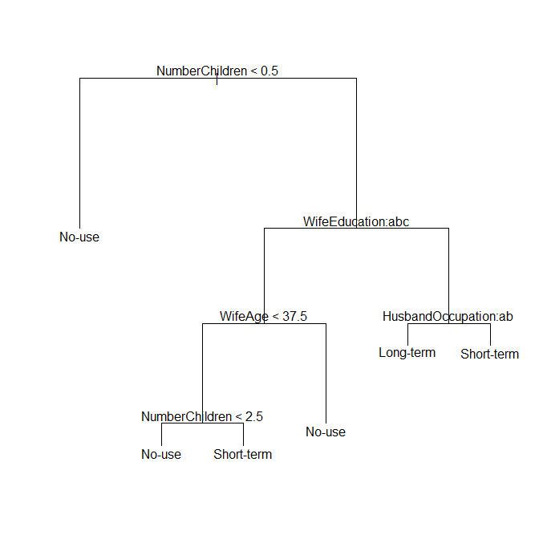

The distribution of the results of the validation data can be seen in the table below.

predicted     |No-use| Long-term| Short-term
--------------|------|----------|-----------
No-use        |   74 |       10 |        26
Long-term     |   22 |       38 |        29
Short-term    | 31   |       21 |        43
|||
Class Total   |127   |       69 |        98
Class Accuracy|0.58  |      0.55|      0.43

As can be seen in the table, the `No-Use` and `Long-Term` classes have about the same prediction accuracy. `Short-Term`, on the other hand, has an accuracy that is more than 10% lower.

## Model Comparison

In this section we will compare our Decision Tree and SVM models based on the test split of our data. This is the only place that references the test split, all other chapters work with train and validation.

Model | Test Accuracy
--- | ---
Decision Tree | 57%
SVM | 52%

**Both models perform relatively bad.** With 56% and 52% accuracy, nearly every second prediction is wrong. This might indicate, that both models aren't complex enough to grasp the problem. Another reasonable explanation could be, that the choice of contraceptive method is more complicated and might need a larger dataset with additional features.

**SVM performs worse than expected.** Since a Support Vector Machine is a more complex model than Decision Trees, we expected SVMs to outperform the decision tree. Even with an expansive hyperparameter optimization, the SVM lags 5% behind the Decision Tree. This is curious, since usually there is an accuracy-explainability trade-off, but in this case, the more explainable model, the decision tree, wins. Possibly, the data set is just not well approximable with SVMs.

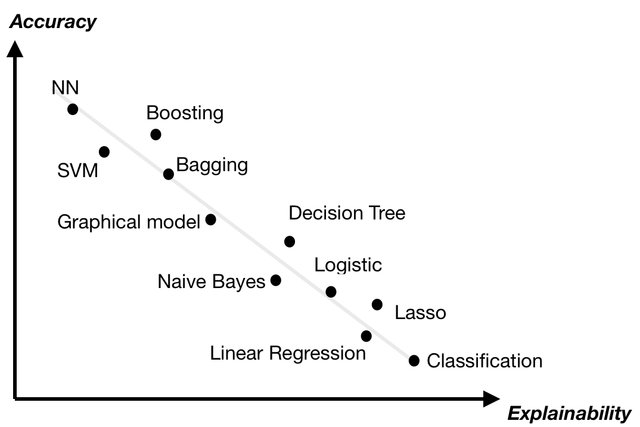

Source: Duval, Alexandre. (2019). Explainable Artificial Intelligence (XAI). 10.13140/RG.2.2.24722.09929.

Sensitivity | No-use | Long-term | Short-term
--- | --- | --- | ---
Decision Tree   |              **0.6471**   |       0.43077 |           **0.5804**
SVM |                 0.5966  |        **0.44615**   |         0.4821

Specificity | No-use | Long-term | Short-term
--- | --- | --- | ---
Decision Tree    |             **0.7966**    |      **0.85281**  |          **0.6957**
SVM |                0.7797 |         0.79654    |        **0.6957**

Comparing sensitivity and specificity, SVMs achieve better sensitivity on `long-term` classes. This is marginally so, however. In every other case, the decision tree proves equal or better.

### Conclusion

Since the decision tree achieves better results in nearly every regard, it is undoubtedly the better approach for this dataset among the two.
