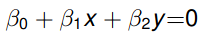
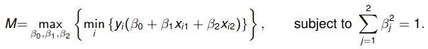
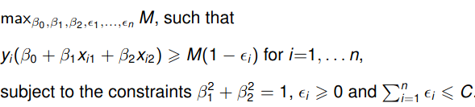
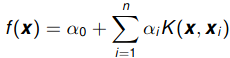
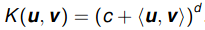

# Mathmatical Overview Support Vector Machine

## Maximal Margin Classifier
This is the most basic building block of the the support vector machine.  
Here we assume that we have a binary classification problem and two predictor
variables. Also we assume the our classification task is linearly seperable.
This means, that there exists a line, which separates the total data correctly.
This raises the question: how do we find this line?  
A general line can be defined with the following equation:  
  
Now the question is, how do we find the best line that separarates the data?
If we know the value of beta it is easy the classify the data, if the result of
the equation is positiv it belongs to class 1, and otherwise to class 2.  
The best values of beta are found if you solve the following equation:
  

## Support Vector Classifier
However real problems are not often lineary separable. What do we do, if the 
problem is more difficult, but still linear?  
We need to allow some points to go over the margin. To achieve this we can
introduce slack variables for every observation called epsilon.
Then we have to solve the following problem:  
  

## Support Vector Machine
Reality is sadly not often linear. A SVM tackles the problem to classify data
where a linear boundary is not sufficient. Therefore the concept of a kernel is
introduced:
We take the data from the original space and transform it to a higher 
dimensional space. We hope to find a linear separation in the higher dimensional
space. This transformed problem is then solved with a Support Vector Classifier.
We use the following formula to transform the data:  
  
K is the kernel function and is in our case a polynomial kernel function:  
  