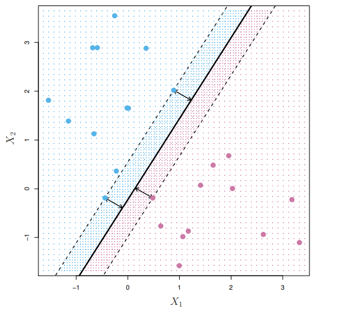
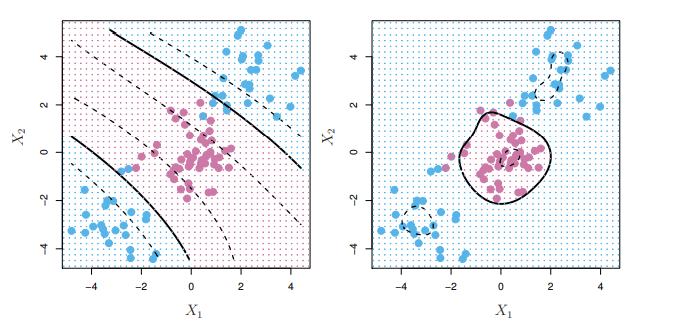

# Mathematical Overview of the Support Vector Machine

While trivial in nature, the mathematical formulas behind the Support Vector Machine are best explained using a three-step-approach: starting with the oversimplified and constrained Maximal-Margin Classifier, we will gradually increase the complexity of the problem to first explain the reasoning behind the Support Vector Classifier and finally of the Support Vector Machine.

We will discuss the exemplary case of a 2-dimensional problem (i.e. the data has two predictor variables). Moving to a higher-dimensional space is trivial afterwards.

## Maximal-Margin Classifier

The Maximal-Margin Classifier (MMC) is the most basic simplification of the support vector machine.

In addition to our 2-dimensional dataset, we assume a binary classification task. Further, for the MMC to work, our data needs to be linearly separable.

Linearly separable means, there exists a line (in higher dimensions this line is called *hyperplane*), which separates all data correctly. This raises the question: how do we find this line?  
A general line can be defined with the following equation:

 (1)

If we know the β values it is easy to then classify a data point (x,y): if the result of equation (1) is positive, a point belongs to class 1, else to class 2. This can be seen as the point lying above or below the line.

To find the best line that separates the data we try to choose β values, such that the distance of every point to the line is maximized, while correctly positioning the data points below or above the line according to their labels.
This is achieved by the following equation:

Where yi(...) is the distance of a point (xi1, xi2) to our separating line. *M* is then the margin between the line and its closest three points, the so-called support vectors. These are the only points required for constructing the line, removing any other vector would not change the resulting line. A representation can be seen in the following image.

The β size constraint originates from the need of having a singular solution. Since our line representation is overparametrized, it normally would have unlimited solutions.

## Support Vector Classifier

Real problems, however, are often not perfectly linearly separable. What do we do, if the 
problem is mostly linear, but has some outliers?

We need to allow some points to go over the margin. To achieve this we introduce *slack variables* for every observation 𝜖1, ..., 𝜖n.
This results in the following, adjusted equation:

An 𝜖i will be zero, if the point is on the correct side of the line, and increasingly bigger depending on how far it is within the margin or beyond the line (bigger than one results in a misclassification). *C* is therefore a hyperparameter which allows us to adjust how many points can be incorrectly represented by the resulting classifier. This results in a wider margin for large *C*, and a smaller margin for small *C*.

With this adjustment, all points within the margin or on the other side of the line become support vectors. Again, any other points can be removed without changing the classifier.

## Support Vector Machine

The next complexity step is removing the linearity constraint. An SVM tackles the problem to classify data where a linear boundary is not sufficient.

Therefore, the concept of a kernel is introduced: Utilizing the so-called *kernel trick* we transform the data from the original space to a higher dimensional space. We hope to find a linear separation in the higher dimensional space. This transformed problem can then be solved with a Support Vector Classifier.

We use the following formula to transform the data:  

With *K* being the kernel function. This is again an adjustable (and optimizable) hyperparameter. Common cases are the polynomial kernel function:

and the radial kernel:

They result in a polynomially transformed (left, of degree 3) or radial (right) boundary, respectively:

It's left to note, that, since the kernel trick introduces an additional dimension during computation, the resulting boundary can often not be represented using a formula in the lower dimension.
